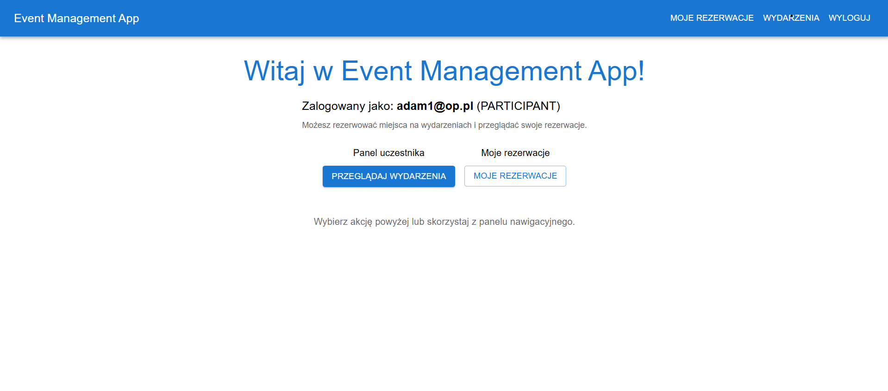
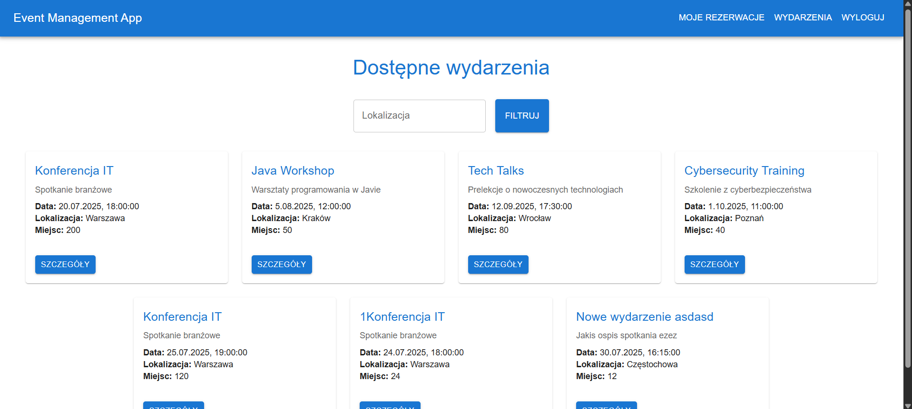
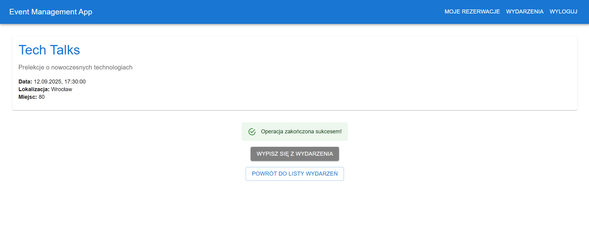
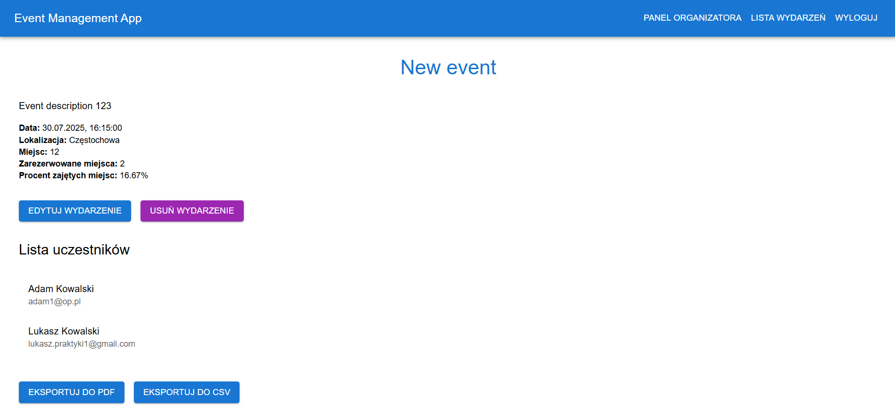
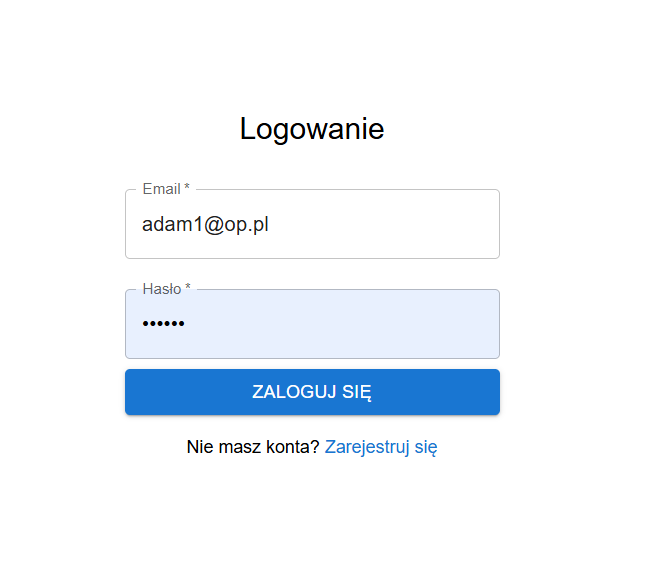

# Event Management App

## Table of Contents
- [Project Description](#project-description)
- [Features](#features)
- [Technologies Used](#technologies-used)
- [Screenshots](#screenshots)
- [Requirements](#requirements)
- [Project Structure](#project-structure)
- [Contributing](#contributing)
- [License](#license)

---

## Project Description
The **Event Management App** is a full-stack web application designed to manage events. It allows users to register as participants or organizers. Participants can browse events, make reservations, and view their bookings, while organizers can create, edit, and manage events, as well as view participants and event statistics.

The application consists of:
- **Frontend**: A React-based web application for user interaction.
- **Backend**: A Spring Boot application for handling business logic, authentication, and database operations.

---

## Features
- **Authentication**: Secure login and registration using JWT.
- **Event Browsing**: View and filter events by date and location.
- **Reservations**: Participants can reserve seats and view their bookings.
- **Event Management**: Organizers can create, edit, and delete events.
- **Participant Management**: Organizers can view participants for their events.
- **Statistics**: Organizers can view event statistics, including reservation rates.
- **Email Notifications**: Users receive email confirmations for reservations.

---

## Technologies Used
### Frontend
- **React**: Frontend library for building user interfaces.
- **TypeScript**: Strongly typed programming language for better code quality.
- **Material-UI (MUI)**: Component library for styling and responsive design.
- **Axios**: HTTP client for API communication.
- **React Router**: For client-side routing.

### Backend
- **Spring Boot**: Backend framework for building REST APIs.
- **Hibernate/JPA**: ORM for database operations.
- **MySQL**: Relational database for storing application data.
- **JWT**: For secure authentication and authorization.
- **JavaMailSender**: For sending email notifications.

---

## Screenshots
### Home Page


### Event List


### Event Details


### Organizer Dashboard


### Login Page


---

## Requirements
- **Frontend**: Node.js (v16+), npm or yarn
- **Backend**: Java 17+, Maven, MySQL


---

## Project Structure
```
event-management-app/
├── backend/                # Backend application
│   ├── src/main/java/com/example/backend/
│   │   ├── controller/    # REST Controllers
│   │   ├── model/         # JPA Entities
│   │   ├── repository/    # JPA Repositories
│   │   ├── service/       # Business Logic
│   │   └── config/        # Configurations (e.g., security)
│   └── src/main/resources/
│       └── application.properties
├── frontend/               # Frontend application
│   ├── public/             # Static assets
│   ├── src/                # Application source code
│   │   ├── api/            # Axios instance for API communication
│   │   ├── auth/           # Authentication context and utilities
│   │   ├── components/     # Reusable components (e.g., Navbar)
│   │   ├── pages/          # Application pages
│   │   ├── App.tsx         # Main application component
│   │   └── index.tsx       # Application entry point
└── README.md               # Main project documentation
```

---

## License
This project is licensed under the MIT License.